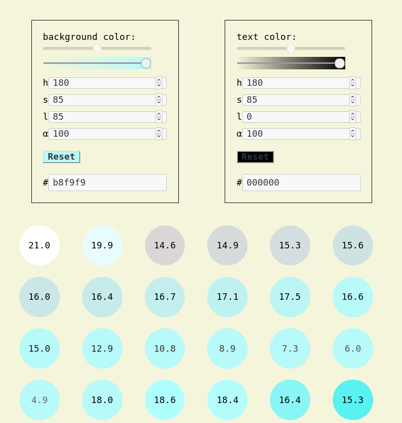

Pick two colors ... and voila!

<!--more-->

## Pick a background color

1. Perhaps it should be warm, which is the right half of the HSL scale, like hue starting from 180deg.
2. Perhaps it should be desaturated a bit (100% → 85%), not fully shiny.
3. If you want the text color to be dark add more light (50% → 85%) to the background. This is the default for now.
4. If you want text color to be light reduce light in background color (try 25%) and increase in text color (try 85%).

## Pick a Text color

1. Start form black, which is set the same as the background color but with 0% lightness.
2. You can increase / decrease lightness up to a level where the text color is still eligible on the background, ie. the color contrast ratio is bigger than 4.5

## Auto generated monochrome palette

1. You'll get the inverse color scheme.
2. You'll get all other color schemes as shades of primary colors which are still eligible.

## To do

1. We need real use cases like a blog, a landing page, or a marketing site to better adjust the algorithm.
2. These real use cases must be semantic, themeable. Picking up two colors should be enough to completely style these use cases. For example the hero should automatically have the inverted color scheme where a call-to-action button is highlighted through the original color scheme. Later, a less important section must have a dominated color scheme. And so on.

## Live example and code

In the [Storybook](https://tinyurl.com/y7mftg53) and on [Github](https://github.com/metamn/mr-ui/tree/master/src/basics/ColorsHSL)
