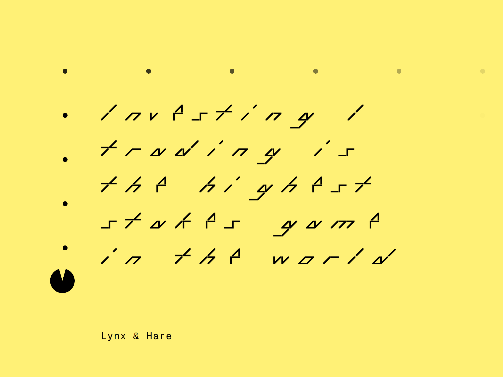
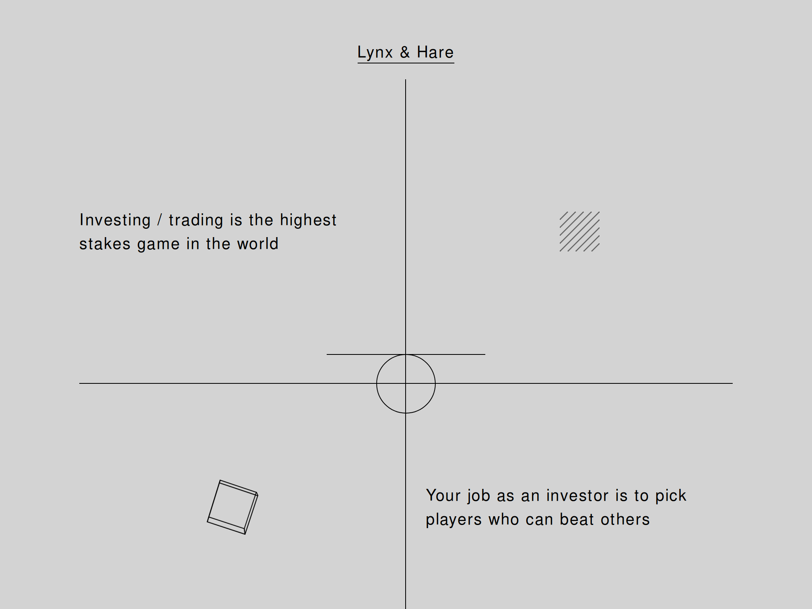
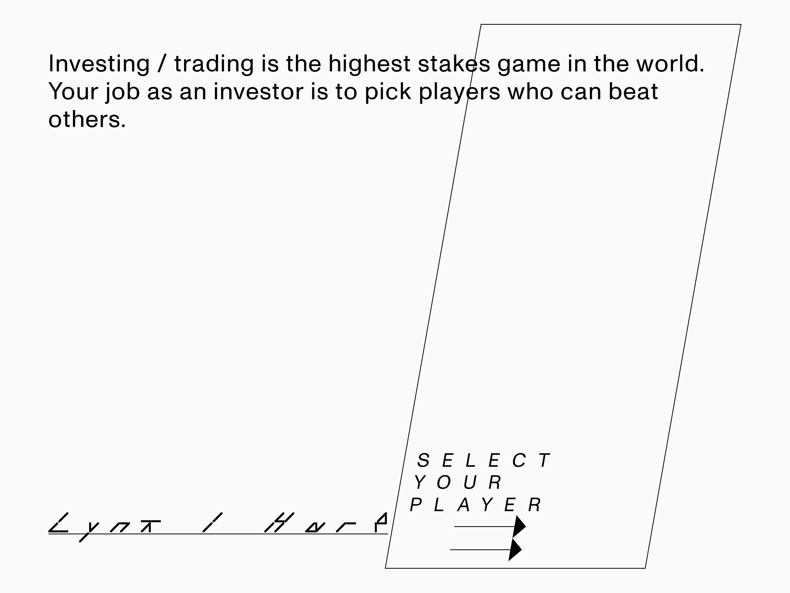
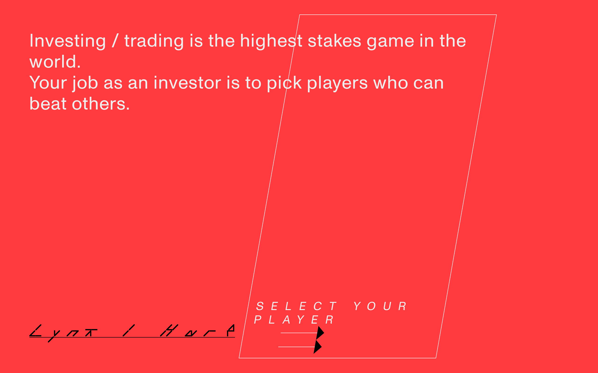
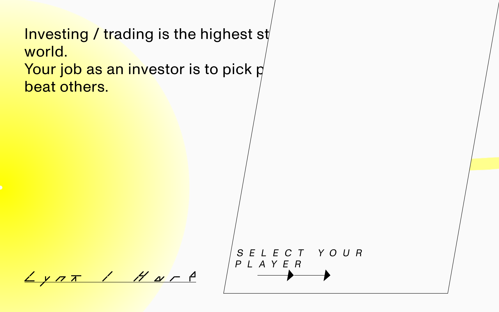
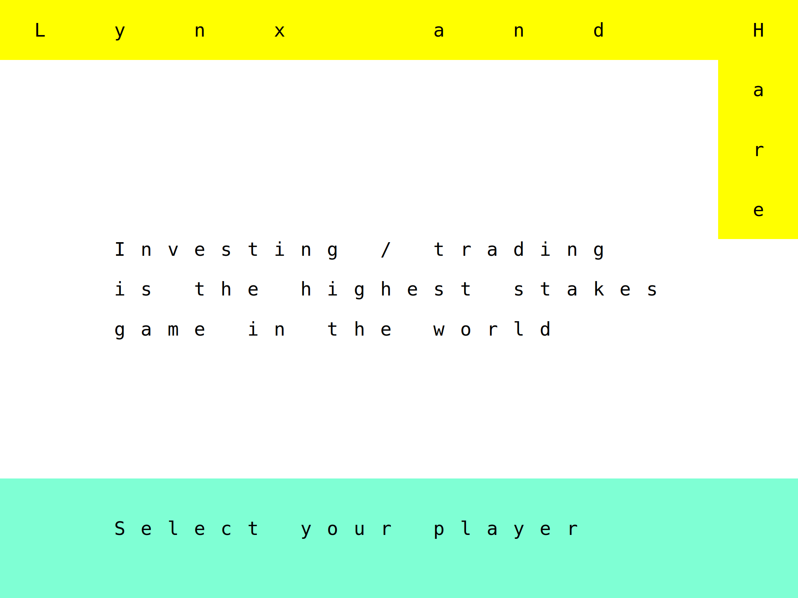
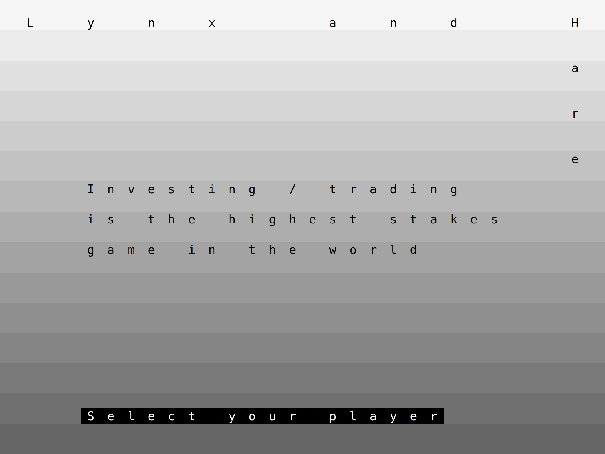
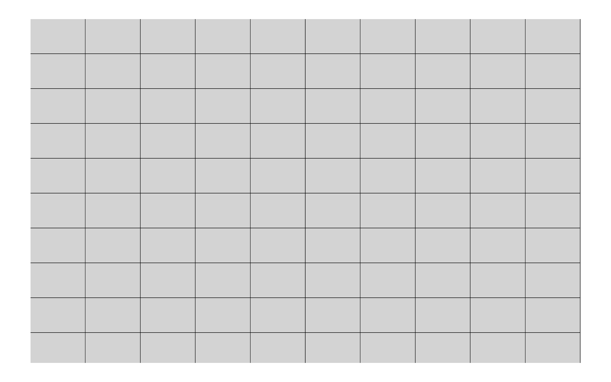

No one can imagine how much creativity gone lost while we had no Storybook or an alternative.

<!--more-->

Storybook ([live on metamn](http://metamn.io/mr-ui/)) is a user interface development environment. Up until now we had integrated development environments (IDE) for any kind of development _but_ UI.

Now with Storybook you are able to:

1. **Tweak** live your work to find edge cases.
2. **Test** it instantly in different contexts like backgrounds and viewports.
3. Have immediate **accessibility** feedback.
4. **Document** your work and experiments beautifully.
5. **Save** every experiment you do for curiosity and later reuse.

And the list is continuously expanding. For me the best part is saving the experiments.

I'm creating experimental user interfaces where every piece of UI on the screen is handmade. More, every single UI piece fits the underlying content which changes from site to site, brand to brand.

This takes lots of experimentation. Just take a look at Lynx & Hare, a landing page I've created recently, and unfortunately not with React and Storybook.

For this project I had no input (zero questions answered in the Design Brief) just 'let it be something like between retro gaming and finance'.

After I've sketched up the first version the direction suddenly went to minimal, _my style_, &mdash; I've even added a PacMan !!! which I had to throw out. Together with that retro button bringing back that 90s feeling.

After creating _my style_ ...

... still the result was not good enough, so I've created a third variant.

I wish I had Storybook at design time. Now all my work would be nicely cataloged, documented, buttons would stick together with other buttons, fonts in the same way, color schemes with another colors schemes,
and in plus I would have live all those variations I have now only as screenshots somewhere on my hard drive.

A variant on red:

This one with a Canvas background and particles moving with the cursor.

Or these, a completely new iteration with type set on a dynamic cell matrix.

On gray background:

... and the underlying cell matrix. I don't have the rotated and skewed screenshots &mdash; they are neat!

Now I've [saved the project to Storybook](http://metamn.io/mr-ui/?selectedKind=Playground&selectedStory=Lynx%20%26%20Hare&full=0&addons=1&stories=1&panelRight=0&addonPanel=storybook-addon-background%2Fbackground-panel&background=beige), at least the layout. You can play with live. And I'll use it as a demo project across the entire UI library in the future.

Just to remind me to be thankful for Storybook every time I use.
