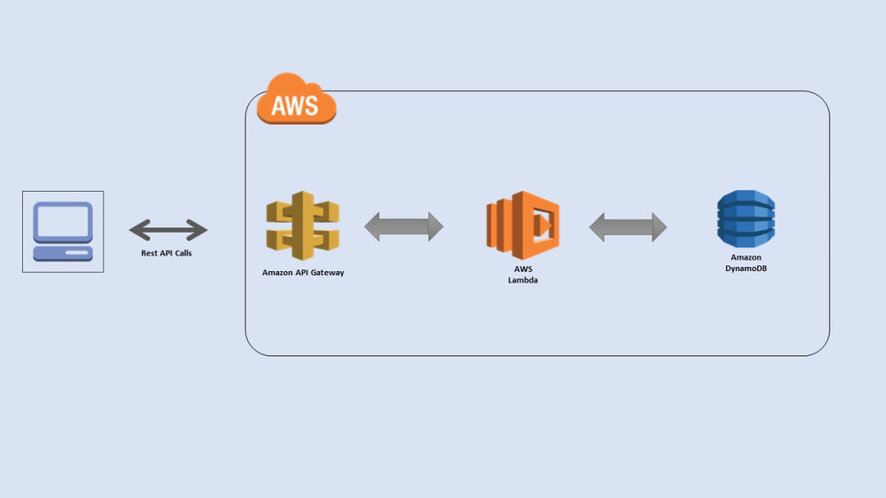
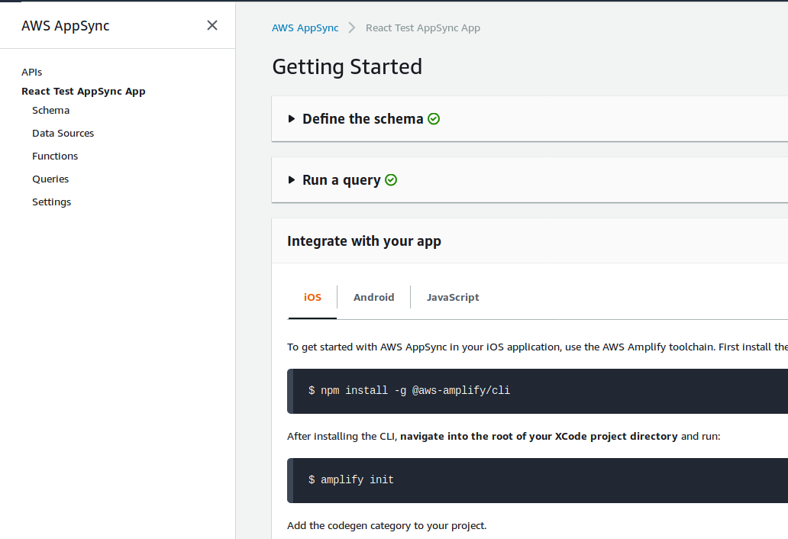

Recently I've been commissioned to find out ways to create APIs on AWS to be consumed by web and native mobile clients.

<!--more-->

---

The landscape is pretty simple. For a classic REST API one can use the Amazon API Gateway service. For GraphQL the AWS AppSync.

At the first sight everything is easy: choose a service. After digging in &mdash; for REST all gets complicated while GraphQL stays clean.

## Reasons

[**AppSync / GraphQL**](https://aws.amazon.com/api-gateway/) has better automation. All additional services needed by the API (functions, data, storage, authorization) are integrated, made quasi-invisible, or configurable with a single click. One has to manage a single umbrella service with an official toolchain. That's all.

[**The REST API Gateway**](https://aws.amazon.com/appsync/) turns out it's just one piece of the puzzle. Unlike AppSync it is not enough to provide an API alone. It needs to be connected manually at least with AWS Lambda and DynamoDB &mdash; standalone services for functions and data.

Instead of one service REST ends up with three. Three times more work? On management yes, on coding more. Since REST has no code generators like GraphQL all code has to be written manually. That results in **more work by a magnitude**.

There are third party generators, tools and frameworks to help. In fact there is an entire industry built around making REST APIs work on Amazon &mdash; it is that complicated.

While in a few days it was possible to set up AppSync with React and play thoughtfully with optimizations and experience (Relay vs. Apollo) &mdash; spending the same time with the REST API was enough only to create and manage the schema. Adding the necessary Lamdba functions and data backend was unsuccessful with generators and tools provided by the ecosystem.

## REST

_Image credits: [https://iotdemos.wordpress.com](https://iotdemos.wordpress.com/2017/04/24/building-simple-back-end-using-aws-dynamodb-lambda-api-gateway/)_

To catch the glimpse of the REST on AWS complexity one should watch these official videos. The first deals with [the difficulty to create an API](https://www.youtube.com/watch?v=xkDcBssNd1g) and the second with [the difficulty of ensuring best practices](https://www.youtube.com/watch?v=9ElpSPXk-g8).

Following the advice from the videos one should use the recommended tools to achieve better results faster:
[Swagger](https://swagger.io/), [Serverless](https://serverless.com/), [Claudia.js](https://www.claudiajs.com/) &mdash; or even try Amazon's own [Amplify](https://aws.amazon.com/amplify/).

My personal experience: no success. Bugs, outdated code and documentation, undocumented features, [frightening](https://serverless.com/blog/node-rest-api-with-serverless-lambda-and-dynamodb) [amount of code](https://serverless.com/blog/serverless-express-rest-api) to be written.

The conclusion left is that AWS REST APIs are of past, complicated, and expensive.

## GraphQL

GraphQL is the successor of REST. It offers the following advantages:

#### 1. Flexible API

GraphQL needs no versioning. One of the pain points of REST APIs was to iterate over versions yet keep it transparent to API clients and end users.

GraphQL removes that and keeps the development and maintenance time smaller.

#### 2. Data-driven apps with real-time and offline capabilities

REST APIs were an artifact before the mobile era. They simply served atomic data per atomic requests. Like a list of all articles for the `/articles` URL. Nothing more.

With mobile devices the requirements changed: there is a need for smarter and low-bandwidth queries (composed on the fly versus the usual REST CRUD operations) which even can be pushed without request (real-time) and are resilient when network services are unavailable (offline capabilities).

A GraphQL app can request all articles together with authors, comments and likes in a single query. This data is automatically cached locally for offline access, and when one of its part is updated (let’s say new article added) the new data is pushed to the device and visualized automatically.

A complete example of a GraphQL stack is the [Facebook 2019 redesign and rewrite](https://developers.facebook.com/videos/2019/building-the-new-facebookcom-with-react-graphql-and-relay/).

## AppSync

[AppSync](https://aws.amazon.com/appsync/) is Amazon's GraphQL service. Manages the API schema, the queries for the schema, the data sources attached to a schema, and the functions / business logic reused across the schema / app.

The great thing, the magic of AppSync is that one has to work only on the schema and forget the rest.

After defining the schema you'll get all GraphQL queries, mutations and subscriptions automatically generated with a single click. And a public URL with a working API out of the box.

Next, by using the [AWS Amplify Framework](https://aws.amazon.com/amplify/) &mdash; a command line tool to create, manage and implement Amazon web services &mdash; with a few simple commands everything else can be set up again, like data, authentication, storage bindings; hosting and even various web and mobile clients to consume the API.

With AppSync and Amplify one can have a mobile-friendly API server and client in ... minutes. Once a schema is done the rest is done by AWS.

# Summing up

<table>
	<thead>
		<tr>
			<th>&nbsp;</th>
			<th>GraphQL</th>
			<th>REST</th>
		</tr>
	</thead>
	<tbody>
		<tr>
			<td>Services to manage</td>
			<td>AppSync</td>
			<td>API Gateway, AWS Lambda, DynamoDB</td>
		</tr>
		<tr>
			<td>Official toolchain</td>
			<td>AWS Amplify</td>
			<td>none</td>
		</tr>
		<tr>
			<td>Code generators</td>
			<td>Functions, Data, Storage, Authorziation, Hosting</td>
			<td>none</td>
		</tr>
		<tr>
			<td>Client SDKs</td>
			<td>iOS, Android, Web, React Native</td>
			<td>Java, JavaScript, Java for Android, Objective-C or Swift for iOS, and Ruby</td>
		</tr>
		<tr>
			<td>Suggested third party services</td>
			<td>none</td>
			<td>Swagger for schema; Serverless.com for tooling</td>
		</tr>
		<tr>
			<td>Development tasks</td>
			<td>Create GraphQL fragments</td>
			<td>Write a complete local server which will be deployed later to different AWS services</td>
		</tr>
		<tr>
			<td>Development environment</td>
			<td>React</td>
			<td>Node.js, Express</td>
		</tr>
		<tr>
			<td>Development skills</td>
			<td>Front-end</td>
			<td>Full stack, AWS engineering</td>
		</tr>
	</tbody>
</table>

## Resources

- [The Amazon API Gateway](https://aws.amazon.com/api-gateway/)
- [AWS AppSync](https://aws.amazon.com/appsync/)
- [The AWS Amplify Framework](https://aws.amazon.com/amplify/)
- [Building the New facebook.com with React, GraphQL and Relay](https://developers.facebook.com/videos/2019/building-the-new-facebookcom-with-react-graphql-and-relay/)
- [Deploy a REST API using Serverless, Express and Node.js](https://serverless.com/blog/serverless-express-rest-api)
- [Building a REST API in Node.js with Lambda, API Gateway, DynamoDB, and Serverless framework](https://serverless.com/blog/node-rest-api-with-serverless-lambda-and-dynamodb/)
- [Building API-Driven Microservices with Amazon API Gateway - AWS Online Tech Talks](https://www.youtube.com/watch?v=xkDcBssNd1g)
- [Best Practices for Building Enterprise Grade APIs with Amazon API Gateway - AWS Online Tech Talks](https://www.youtube.com/watch?v=9ElpSPXk-g8)
- [Swagger](https://swagger.io/)
- [Serverless](https://serverless.com/)
- [Claudia.js](https://www.claudiajs.com/)
