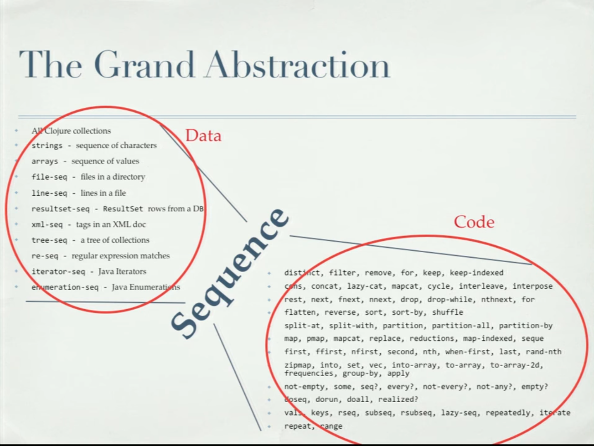

I optimize for less cognitive load.

<!--more-->

---

Unlike its counterparts &mdash; Elm, Ruby on Rails, re:frame of ClojureScript &mdash; React is a less-opinionated framework.

It leaves what to optimize for on the developer. I choose simplicity, as little cognitive load as possible.

React is a glue. Sits in the middle, between the user interface and the back-end, connecting multiple domains.

When React becomes a second nature it leaves room for acquiring expertise in the connected domains. It's better to focus on the domains than getting stuck with a framework connecting them.

[Responsive web design](https://web.dev/new-responsive/?utm_source=CSS-Weekly&utm_campaign=Issue-461&utm_medium=email), [screen typography](https://maxkoehler.com/posts/continuous-typography/), HTML and CSS is changing after a decade of stagnation; creating scalable design systems and component libraries is a [challenge](http://metamn.io/react/on-design-sytems/); event-driven architectures, reactive and functional programming are skills to learn.

On the other hand, optimizing for a goal helps decision making.

Coding is decision making. When the goal is clear, making decisions is easy.

## Less cognitive load

It sounds vague but reducing cognitive load is possible, desirable at every phase in React development.

Creating a new component? Use a generator. No need to remember component structure and to write boilerplate code.

Importing a component? Use module path aliases. No need to remember project folder structure.

Defining function signature? Use a single composite prop. Then deal with the details later. No need to worry prematurely about data structures.

Writing logic? Use a general abstraction to tackle every problem in the same way.

Too much code inside a file? Split into atomic, standalone, small units responsible for a single aspect of the problem. Focus on a single aspect at once, iterate all aspects, then compose up the final result.

Sparing attention with little tricks add up. The less attention needed for non-creative code the more attention stays available for writing _real_ code.

## Generators

To make code look uniform I use generators.

Instead of manually creating project files, folders &mdash; and writing boilerplate code &mdash; I generate them.

For VSCode I use [VSCode Folder Templates](https://github.com/Huuums/vscode-folder-templates). In a project where team members use different editors we go for a command line generator like [New Component](https://github.com/osequi/new-component).

The generator generates all files a component needs: the main component file, test and documentation files, style and data declarations, or anything else specific to the project.

Inside every file the generator generates boilerplate code. The final result is uniform, and is ready in seconds vs. minutes when code and structure duplicates by hand.

A simple component generator example:

```js
// [FTName].tsx
import React from "react";
import { TComponent, component } from "@components";
import { edoStyle } from "@tokens";
import { defaultsDeep } from "lodash";

export interface T[FTName] extends TComponent<null> {}

export const [FTName | lowerCase]: T[FTName] = {
  ...component
};


export function [FTName](props: T[FTName]) {
  const props2 = defaultsDeep({...props}, [FTName | lowerCase]);
  const {className} = props2;

  const style = edoStyle(className, "[FTName]");

  return <p {...style}>[FTName]</p>;
}
```

```js
// index.ts
export * from './[FTName]'
```

After generating a `Button` component the result becomes:

```js
// Button.tsx
import React from 'react'
import { TComponent, component } from '@components'
import { edoStyle } from '@tokens'
import { defaultsDeep } from 'lodash'

export interface TButton extends TComponent<null> {}

export const button: TButton = {
  ...component,
}

export function Button(props: TButton) {
  const props2 = defaultsDeep({ ...props }, button)
  const { className } = props2

  const style = edoStyle(className, 'Button')

  return <p {...style}>Button</p>
}
```

```js
// index.ts
export * from './Button'
```

## Component structure

To make component code better understandable, to enable a common structure, I use logical units.

Every component is built on three sections:

- Imports
- Type and data definitions
- Component logic

```js
// Button.tsx

/**
 * Imports
 */
import React from 'react'
import { TComponent, component } from '@components'
import { edoStyle } from '@tokens'
import { defaultsDeep } from 'lodash'

/**
 * Type and data definitions
 */
export interface TButton extends TComponent<null> {}

export const button: TButton = {
  ...component,
}

export const buttonQuery = `` // GraphQL

/**
 * Component logic
 */
export function Button(props: TButton) {
  const props2 = defaultsDeep({ ...props }, button)
  const { className } = props2

  const style = edoStyle(className, 'Button')

  return <p {...style}>Button</p>
}
```

## Imports

[Absolute imports and module path aliases](https://nextjs.org/docs/advanced-features/module-path-aliases) is a Typescript feature making project imports better comprehensible and easier to write.

In `tsconfig.json` one can set up aliases, `paths` pointing to common folders in the project.

```json
{
  "compilerOptions": {
    "paths": {
      "@data": ["data/"],
      "@apps/*": ["apps/*"],
      "@components": ["components"],
      "@tokens": ["tokens/"]
    }
  }
}
```

Then in components, project-related `imports` use these aliases vs. figuring out relative paths.

`import { edoStyle } from '@tokens'` is easier to remember than `import { edoStyle } from '../../design-system/tokens'`.

## Type and data definitions

Programming is about transformation. The problem comes in, it gets solved, and the solution goes out.

The problem comes in as data. To describe it I use PropTypes, TypeScript and optionally, when the data comes from an API, GraphQL or JSON.

In any case I use type definitions.

Even when the data comes from the API.
At first it seems definition duplication but the scope differs.

Type definitions assure the transformations (the functions) won't break.
Data definitions assure the front-end is in sync with the back-end.

When no data comes from the API, type definitions help to lay out a front-end API.

Yes, the front-end needs an API too. Otherwise how do you build a design system, or component library, with dozens of components and another dozen tokens with no back-end dictating a data structure?

### Single-responsibility Principle

In addition, type definitions make sure the component is minimal in scope, following the [Single-responsibility Principle](https://en.wikipedia.org/wiki/Single-responsibility_principle).

More than one type definition inside a component is a code smell. It means the component should split. It does more than a well-defined singular task.

```js
// This is a code smell.
// `project`, `projects` should merge into a single interface.

export interface TProjectSlugPage extends TComponent<null> {
  seo: TSeo;
  project: TProjects;
  error: TError;
}

export interface TProjectList {
  projects: TProjects;
}
```

## Default values and function signatures

There are ways to define component props and associate default values to them.

A common approach is to destructure props in the function signature. Another approach is to destructure them in the function body.

```js
// Destructuring in function signature
function Video({prop1, prop2}: TVideo) {...}

// Destructuring in function body
function Video(props: TVideo) {
  const {prop1, prop2} = props
}
```

Associating default props comes with at least three different approaches.

```js
// Associating default props in function signature
function Video({prop1, prop2}: TVideo = video) {...}

// Associating default props in function signature at destructuring
function Video({prop1: 'prop1', prop2: 'prop2'}: TVideo) {...}

// Associating default props in function body
function Video(props: TVideo) {
  const {prop1, prop2} = merge(props, video)
}
```

Which approach is better? Which approach is complete? What makes an approach better than another?

A [quick analysis](http://metamn.io/react/on-function-signatures/) shows where to destructure props, and assign default values to them depends on the shape of the props.

When props are a flat object and small in number, destructuring in function signature + assigning default values at destructuring, wins. In a capable editor `ctrl+hover` over the function name displays good enough usage information.

Nested props require a special deep merging function to associate with the default props. This implies destructuring in the function body.

The developer experience with `ctrl+hover` over the function name is less pleasant: the default values, helping to infer the prop type, are not shown.

A practice to follow should be:

```js
// Props are flat and small in number.
// This approach is recommended.
//
// This approach gives the best developer experience:
// On `ctrl+hover` the type of the props can be inferred from their default value.
function Video({prop1 = 'prop1', prop2 = 'prop2'}: TVideo) {...}
```

```js
// Props are flat but large in number.
// This approach is not recommended.
function Video({
  prop1 = 'prop1',
  prop2 = 'prop2',
  prop3 = 'prop3',
  ...
  ...
  prop10 = 'prop10'
  }: TVideo) {...}
```

```js
// Props are flat but large in number.
// This approach is recommended for better code readability.
//
// On `ctrl+hover` this approach doesn't give hints about the type of the props.
function Video(props: TVideo) {
  const propsMerged = defaultsDeep({ ...props }, defaultProps)
  const { prop1, prop2 } = propsMerged
}
```

```js
// Props are nested.
// This approach is recommended (perhaps the only viable option).
function Video(props: TVideo) {
  const propsMerged = defaultsDeep({ ...props }, defaultProps)
  const { prop1, prop2 } = propsMerged
}
```

## Functional abstraction

React plays the [functional and reactive](http://metamn.io/react/the-reactive-fuctional-nature-of-react/) game.

It borrows often from Clojure/ClojureScript, a language built on a grand abstraction.


_From Alex Miller's screencast [Clojure Enemy of the State](https://youtu.be/qe60zwUAOqE)_

The idea is to transform initial data into a series of sequences and apply standard code upon the sequences.

This is how Clojure solves problems. Divides a problem into subproblems &mdash; small sequences &mdash; and applies standard problem solving techniques on each sequence.

The key is standard code / standard problem solving technique.

Clojure offers a vast standard library capable of manipulating all kinds of sequences. The task of a developer reduces to _using_ the library vs. writing her own code. This way the solution is better: approved, used and reused by a community vs the brainchild of a single individual.

The Clojure way simplifies problem solving to a single task: find the best sequences. The rest is handled by previous wisdom.

I use the same approach in writing React component functions.

I start with the data (props), then create sequences from props, where I apply &mdash; ideally &mdash; standard functions.

```jsx
export function Video(props: TVideo) {
  /**
   * Start with the data
   */
  const props2 = defaultsDeep({ ...props }, video)
  const { className, hosted, served } = props2

  /**
   * Chopped sequences: `hosted`, `served`
   * Apply function on sequences
   */
  const url = getVideoUrl(hosted, served)
  if (!url) return null

  /**
   * Chopped sequence: `className`
   * Apply function on sequence
   */
  const style = edoStyle(className, 'Video')

  /**
   * When all the subproblems are solved ...
   * ... return the result
   */
  return <ReactPlayer url={url} {...style} />
}
```

There's nothing extraordinary in the code above. It looks natural, and should look natural.

The advantage shows in time. A standard library grows along the projects offering reliability and faster development time for its users.

On another hand this technique offers uniform thinking across a team. It reduces the problem solving process to:

`problem === data -> sequences -> solutions -> composition === solution`.

## Functional style

A key approach in functional programming is to create atomic sequences / subproblems and atomic solutions for them.

An atomic problem / solution is not further reducible. It is pure, it exists in a canonical state.

Practice shows systems compose up better when the underlying constructs, components are atomic / pure.

In the example above both `defaultsDeep`, `getVideoUrl`, `edoStyle` and `ReactPlayer` are atomic. They can't be further reduced. And they return predictable results which compose up nicely.

If we look deeper, let's say into the `getVideoUrl` code, we should see pure / atomic code, again.

```js
export function getVideoUrl(hosted, served): string[] | string | null {
  if (!hosted && !served) return null
  return hosted && hosted?.videoUrl
    ? getHostedUrl(hosted)
    : getServedUrl(served)
}
```

And so on.

```js
export function getHostedUrl(hosted): string | null {
  return hosted?.videoUrl
    ? canPlayUrl(hosted?.videoUrl)
      ? hosted?.videoUrl
      : null
    : null
}
```

I tend to write pure / atomic functions. Not in the strict but the logical sense.

## Functional programming with Ramda

[Functional programming](https://github.com/MostlyAdequate/mostly-adequate-guide) is not a silver bullet. And it's hard to learn when one is coming from object-oriented, imperative programming &mdash; as the majority of us do.

Understanding its principles and applying its style is often enough in a React environment. A short learning assures immediate better code.

I often find myself in front of a problem more complex than mapping and reducing data.
In such cases I appeal to [Ramda](https://ramdajs.com/), a functional library for JavaScript.

Ramda is transparent to React. No matter if you write `getVideoUrl` with Ramda or JavaScript. React can't sense the difference.

The difference is in the cognitive load of the developer.

Writing slightly complex algorithms in the imperative way I found to take a larger toll on my attention and patience than writing the same algorithm with Ramda.

With Ramda I think more about the problem &mdash; in time, in depth &mdash; and write less code.

The end result feels compact. Even if I use only a small subset of the functional programming toolset &mdash; immutable data, curried functions, and compositions.

## Co-location

In pursuing simplicity &mdash; applying the 'rules' above &mdash; components decompose into smaller parts.

Oftentimes they decompose into multiple files. React calls this phenomenon co-location.

The component folder co-locates files specialized in single tasks: component code, component logic, style, tests, dev notes, specifications and anything else.

When the developer opens a folder it gets the big picture. What libraries, techniques this project is built on, how complex and complete the component is, where to start the work.

Then opens a file, reduces the focus, thus the cognitive load, to a single aspect of the problem. And works in peace.

```bash
# A sample component folder structure
Video.tsx
Video.test.tsx
Video.functions.ts
Video.functions.test.ts
Video.style.ts
Video.md
...
```

## Summary

Reducing cognitive load should pay off.

Little things and tricks can spare attention &mdash; preserve it for solving the bulk of the problem.

Hopefully, this approach scales beyond individuals enabling faster and more concise development for teams.

After all, it is about simplifying structures and models.

<table>
<thead>
	<tr>
		<th>Structure, model</th>
		<th>Simplifying technique</th>
		<th>Reduces cognitive load on / to</th>
	</tr>
</thead>
<tbody>
	<tr>
		<td>Folders</td>
    <td>Generators</td>
    <td>Boilerplate code</td>
  </tr>
  <tr>
		<td></td>
    <td>Path aliases</td>
    <td>Locating of components</td>
  </tr>
  <tr>
		<td></td>
    <td>Co-location</td>
    <td>Aspects</td>
  </tr>
  <tr>
		<td>Components</td>
    <td>Logical sections</td>
    <td>Locating parts of the component</td>
  </tr>
  <tr>
		<td>Data</td>
    <td>Always have an API</td>
    <td>Thinking about correctness</td>
  </tr>
  <tr>
		<td>Main function</td>
    <td>Simple function signature</td>
    <td>Thinking prematurely about non-significant aspects</td>
  </tr>
  <tr>
		<td></td>
    <td>The Grand Abstraction</td>
    <td>Thinking in sequences, don't worrying about the rest</td>
  </tr>
  <tr>
		<td>Other functions</td>
    <td>Pure, atomic, Single-responsibility Principle</td>
    <td>Solve simple problems at once</td>
  </tr>
  <tr>
		<td>Programming</td>
    <td>Functional, with Ramda</td>
    <td>Composing up, declaring a solution</td>
  </tr>
</tbody>
</table>

## Resources

- [The new responsive: Web design in a component-driven world](https://web.dev/new-responsive/)
- [Continuous Typography](https://maxkoehler.com/posts/continuous-typography/)
- [On design systems](http://metamn.io/react/on-design-sytems/)
- [VSCode Folder Templates](https://github.com/Huuums/vscode-folder-templates)
- [New Component](https://github.com/osequi/new-component)
- [Absolute Imports and Module path aliases](https://nextjs.org/docs/advanced-features/module-path-aliases)
- [On function signatures](http://metamn.io/react/on-function-signatures/)
- [Single-responsibility Principle](https://en.wikipedia.org/wiki/Single-responsibility_principle)
- [The reactive, functional nature of React](http://metamn.io/react/the-reactive-fuctional-nature-of-react/)
- [Clojure Enemy of the State](https://youtu.be/qe60zwUAOqE)
- [Professor Frisby's Mostly Adequate Guide to Functional Programming](https://github.com/MostlyAdequate/mostly-adequate-guide)
- [Ramda JS](https://ramdajs.com/)
