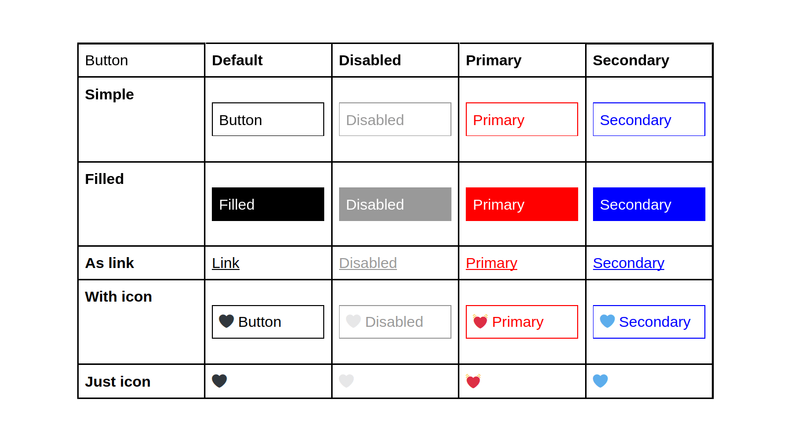

Tools and processes.

<!--more-->

---

## TLDR;

Design systems are a paradigm shift in UX/UI design and front-end development for native and web applications, sites.

With a systematic approach to the design process, design systems produce consistent and scalable user interfaces.

Companies with resources lead the adoption.
They do it by augmenting old tools and processes with extensive mind power.

Smaller companies with less resources must innovate to keep up.

## The current landscape

Design systems are new, yet old.

They've been around since 2015 when Google rolled out Material Design.
Still, only dedicated companies can afford to have their own design system today.

The rest builds on open source, freely available component libraries and design systems by employing heavy customizations.

If one goes further &mdash; and tries to roll out a hand-made design system for its own audience &mdash; hits the same obstacles as their predecessors.

For Airbnb, it took several years and iterations to come up with a solution which scales.

Design systems are hard.

They introduce a systematic approach to a domain previously ruled by human-driven, ad-hoc processes.

## Before design systems

Google is a company with dozens of digital assets &mdash; email, maps, search, ads, video, and many more &mdash; across all platforms.

Before employing a design system these assets were looking more-or-less the same, in the best case, but many times completely different.

Material Design made the entire Google portfolio to look consistent, following unconditionally and perfectly the brand design guidelines.

Whatever the asset, whenever the platform might be.

## What a design system does?

It offers a systematic approach to the design process to reduce the cognitive load on designers. Less load, more consistent interfaces.

To understand the amount of the cognitive load on designers, let's take for example the buttons. In a simple use case, we have 20 variations.

Aside to buttons, a design deals with dozens of other, more complex patterns and components like layout, spacing, typography, navigation, responsiveness, images, animations, accessibility and more.

A designer &mdash; to be able to reason about, modify, or extend a design &mdash; has to keep in her mental model an uncomfortable amount of information. The details, the nuances, the settings, the states.

Design systems solve this challenge via the _divide et impera_ method.

They separate design into small, independent and manageable parts / layers &mdash; style tokens, components, sections, pages, sites, apps &mdash; and enforce consistency on the entire path, across the entire portfolio.

Each layer is independent, self-contained, and acts as a single source of truth for its own domain.

Each layer builds on the previous layer &mdash; without the ability to modify it.

For example, tokens &mdash; the base layer &mdash; are atomic, and their single responsibility is to describe style via pure data.

Components build on tokens, but they don't interfere with tokens.
They use tokens for styling, but they can't add new, custom styles.
If a new style element is required &mdash; first it is added to the tokens, then the component becomes able to use it.

This separation of concerns, augmented with strong human discipline, makes consistency and scalability achievable across hundreds of tokens, components, sites and apps.

## Tools and processes

The systematic approach brought by design systems left untouched the tools and the workflow.

They are the same today as they were before design systems.

Designers use visual, non-programmable tools like Figma, Sketch, Adobe Illustrator etc. to create the layers of a design system.

These tools are visualization tools, not decision-making tools.

When a designer has to make a decision &mdash; to change, extend a design &mdash; again, she has to build a mental model first, even if the model is now smaller due to the design system approach.

The decision made cannot be proven correct in an objective way like we used to have in software development, or in other exact science.

Designing with mental models is error-prone. Introduces continuous uncertainty. And, for scaling, requires human resources.

The other drawback of the visual, non-programmable design tools is the deliverables they produce.

The designer's work needs to be further translated to the target medium by developers. This process is communication-heavy, error-prone again, and far from being real-time.

## Better tools and processes

It's easy to observe: the tools used by designers produce side effects related to scalability, communication latency and cost.

They are the bottleneck in the process of building consistent user interfaces in a scalable way, and, affordable for companies with less resources.

What if the tools in the design process &mdash; in the same way as in the development process &mdash; would be programmable?

What if the outcome of a design process would be a program / data instead of the current visuals-to-be-translated-into-code mess?

That would solve the mental model capacity problem and reduce the design and development process to real-time.

## Design systems as a database

Imagine the design system as a database.

Tokens, components, sections, pages, apps, sites &mdash; all quantifiable, thus correct. All queryable, to an arbitrarily small level, to fit comfortably into a single person's mental model.

Databases handle billions of entries and help us reason about infinite relationships.
They help us make correct decisions and ensure changes happen in real-time.

Designing with the help of databases would offer the same benefits.

It sounds like utopia &mdash; but it can be done today and requires only a minor cultural shift.

## Pair designing

Pair programming is an age-old paradigm.

Two developers sit in the front of a single machine. They collaborate instantly and produce a single output.

Pair designing would be similar. A designer and a developer would sit at a single desk and produce a single output.

The designer would still use her own favourite visual tool like Figma.
But the deliverable would not be official &mdash; just a temporary result.

The developer would instantly input the Figma deliverables into a design system built on code, like a database.

That would be the final, official deliverable &mdash; a living design system.

## A case study

I'm fortunate enough to both have a computer science degree and design works featured in online galleries.

I'm a developer who designs. An ideal pair designer.

In 2015, I've rolled out my portfolio powered by a [living styleguide](http://metamn.io/v1/styleguide/). There were no design systems at that time &mdash; by the term coined. The rest was / is still [the same](http://metamn.io/beat/creating-a-styleguide-with-gulp/).

Since then, [I'm working](https://osequi.com/) in this novel domain.

I produce unique looking websites and apps for progressive brands with the help of a handcrafted, tailor made, built-from-scratch, completely customizable design system.

With a considerable investment yielding high rewards.

I've [analysed](https://docs.google.com/spreadsheets/d/1Yn-fzRIfXcpFilQwjv62MC4yRCTQFaS2qhhtbnfohhg/edit?usp=sharing) design systems and implementations; [wrote](http://metamn.io/react/on-design-systems-1/) [articles](http://metamn.io/beat/design-systems-are-a-cultural-challenge/); a [mini-book / technical guide](https://docs.google.com/document/d/1ukf5kDq7pHGnnExUstssu5Xtl-2yT3KxUp4XU8vvpzE/edit?usp=sharing); learnt [other languages](http://metamn.io/beat/clojure/) and stacks to better understand the current theory and common practices; done four complete iterations on the code base; employed the result in a couple of real-life applications.

Today, in short, this custom-made design system / component library offers:

1. **Wireframing** &mdash; To sketch up the requirement specifications and get immediate feedback.
2. **Mockuping** &mdash; To show real-life-like components, helping to finalize the requirements, the information architecture and the data structure.
3. **Inline content editing** &mdash; To let editors add content at an early stage, to find out missing parts and inconsistencies in the original requirement specification.
4. **Theming** &mdash; To support design trials and errors, iterations and variations, rollbacks, in a fully responsive way.
5. **Living documentation and playground** &mdash; Generated from code, to assure the design system driving the final product is tested, and all its parts are documented.

All these live, inside the browser.

No 3rd parties like Figma, Sketch, Storybook and co.

What you see is what you've already got.

Production-ready code with React, Typescript and CSS-in-JS.
Statically generated pages using a headless CMS and GraphQL.

Simple, code-based tools.
Real-time production process with verifiable, scalable deliverables.

In less time, cost and hustle.

## Resources

1. [Building (and Re-Building) the Airbnb Design System](https://www.infoq.com/news/2020/02/airbnb-design-system-react-conf/)
2. [A living styleguide from 2015](http://metamn.io/v1/styleguide/)
3. [Creating a styleguide using a database (2015)](http://metamn.io/beat/creating-a-styleguide-with-gulp/)
4. [OsEqui, a design systems consultancy](https://osequi.com/)
5. [Design systems are a cultural challenge](http://metamn.io/beat/design-systems-are-a-cultural-challenge/)
6. [Design Systems Analytical Framework](https://docs.google.com/spreadsheets/d/1Yn-fzRIfXcpFilQwjv62MC4yRCTQFaS2qhhtbnfohhg/edit?usp=sharing)
7. [On Design Systems - A mini book / technical guide](https://docs.google.com/document/d/1ukf5kDq7pHGnnExUstssu5Xtl-2yT3KxUp4XU8vvpzE/edit?usp=sharing)
8. [Design Systems - Context and deliverables](http://metamn.io/react/on-design-sytems-1/)
9. [Clojure, and the limits of the Javascript ecosystem](http://metamn.io/beat/clojure/)
