Consistent user interfaces in web context.

<!--more-->

---

## Consistent user interfaces

Consistent &mdash; coherent and uniform &mdash; user interfaces eliminate all visual and logical glitches.

User interfaces, when consistent, _feel_ complete. They have no visible errors, and the experience they provide resembles enjoying an artwork.

Consistent, [by definition](https://www.wordnik.com/words/consistent), is in agreement with itself. It holds true as a group, it's not contradictory. It's marked by an orderly, logical, and aesthetically consistent relation of parts. It's unity and harmony.

Consistent UIs talk about the intent and the mastery of its creators. They persuade. They deliver an important message.

## The current landscape

Until recent years, creating &mdash; designing and developing &mdash; consistent user interfaces were an almost impossible task.

With [design systems thinking](http://metamn.io/react/on-design-systems-2/) and by introducing a novel design process &mdash; now it is possible to _design_ them.

But is it possible to implement them?

Stil, current UX/UI design tools and processes, even with design systems, produce visual deliverables which later must be translated to code &mdash; implemented on target platforms, in specific context.

This article examines the web context.

How to develop consistent UIs with web technologies. How to implement a consistently designed UI on the web platform.

## The web

The web platform &mdash; we all know very well &mdash; is the browser.

By using technologies like HTML, CSS, Javascript, WebGL, and more, it manages to display interactive information across different devices and operating systems.

Developing consistent UIs in web context, thus, translates into implementing a design system with HTML, CSS, and Javascript, and run it in the browser.

## The context

Web design and development has a long history. Through decades it evolved from one paradigm to another.

Let's put design systems into a historical context. Each quadrant representing an era in web development.

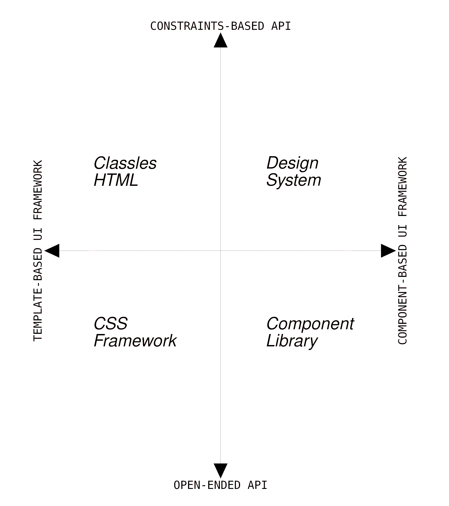

The historical timeline is depicted counter-clockwise.

The axes connect web development to general software development terms and context: APIs and frameworks.

And the story, in short, follows.

In the beginning &mdash; **Classless HTML** &mdash; there weren't much styling on websites. HTML was not linked to CSS via class names &mdash; hence the name. However this paradigm lately became a [trend](https://css-tricks.com/no-class-css-frameworks/) due to it's simplicity and scalability.

**CSS Frameworks** are the longest reigning paradigm. They are ubiquoitus. Perhaps they style 90% or more of all webpages today. Just to name a few of them: Bootstrap, Foundation, Tachyons, Bulma, Tailwind.

**Component libraries** and **design systems** are new. The line between them is blurry &mdash; for the novice &mdash; but very important. It makes a UI consistent or not.

## The journey

It takes a journey from the term `user interfaces` to `consistent web user interfaces`. A dozen of steps, some steps depicting an era in front-end development.

For those on the run, there is a big picture. It's enjoyable on larger screens via a click.

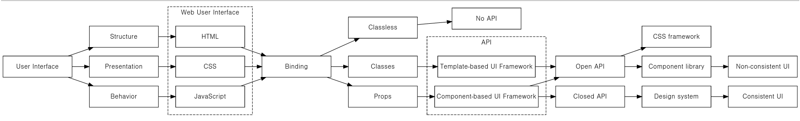

For the rest, there is a breakdown. A step-by-step guide where at the end a consistent UI unfolds.

## User interfaces

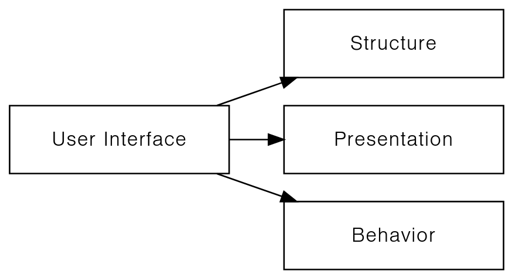

User interfaces display a certain type of information. Information equipped with structure, presentation and behaviour.

Structure and presentation is familiar from graphic and print design. It defines layout and style.

Behaviour is specific to interactive environments like the web. This dynamic context requires the user interface to handle change &mdash; to behave on change.
Per se, it equips information with a dynamic attribute.

## Web user interfaces

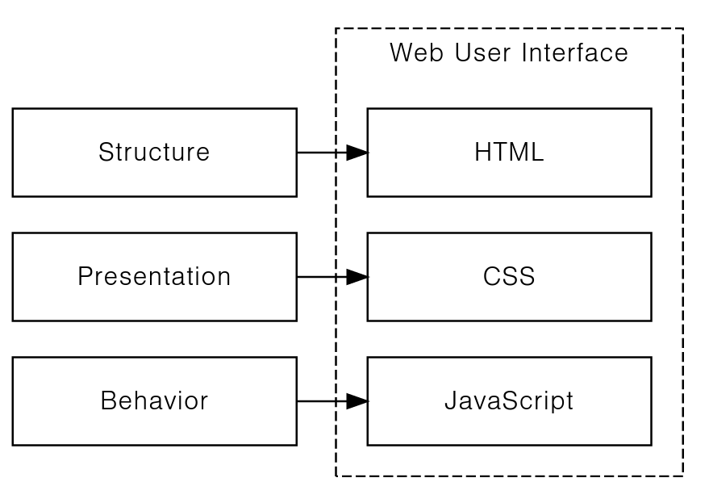

Web user interfaces rely on a specific technology &mdash; the browser &mdash; to display information.

Browsers:

- Structure information with **HTML**.
- Define style via **CSS**.
- Handle behaviour using **Javascript**.

## Binding

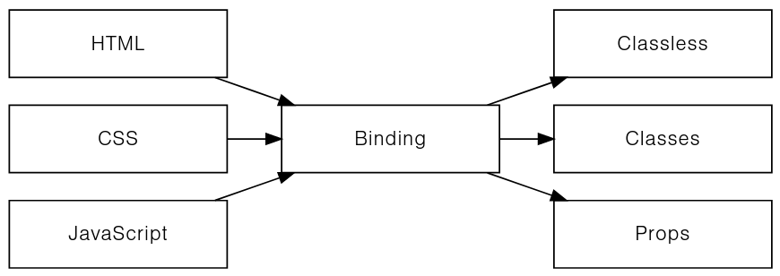

HTML, CSS and Javascript are standalone technologies. To work together &mdash; they need to be merged, bound together.

The way of binding &mdash; the binding methods &mdash; are important. Each method defines an era in front-end development.

#### Classless

This paradigm makes no bounds between HTML, CSS and Javascript.
It leaves binding exclusively to the browser.

HTML has no classes, styles attached. Styling comes from a separate CSS file, where all HTML elements are styled by name.

#### Class-based binding

The next paradigm connects the separate parts &mdash; HTML, CSS, Javascript &mdash; via class names, a special HTML attribute.

In spite being the longest reigning paradigm &mdash; CSS frameworks &mdash; it's fragile on scaling, composition.

#### Props

The latest advancement &mdash; component libraries and design systems &mdash; integrate &mdash; bind natively &mdash; all parts of the displayable information &mdash; structure, style, behaviour &mdash; into a single standalone component.

This is where hope lies to build consistent UIs.

## API

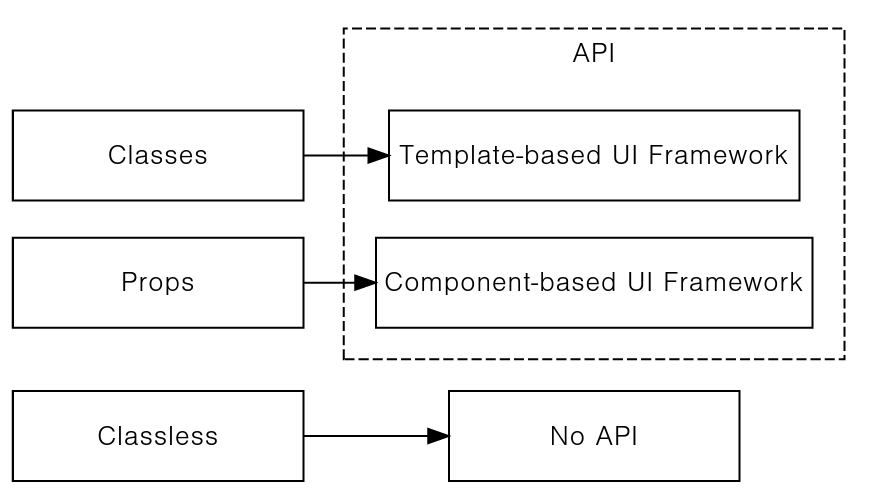

The acronym stands for Application Programming Interface and comes from general software development theory.

APIs bind together standalone parts of a software system &mdash; in our case HTML, CSS and Javascript &mdash; in a programmable way.

The higher the programmability of the bindings, the better the quality and scalability of the system.

## Template- and Component-based UI frameworks

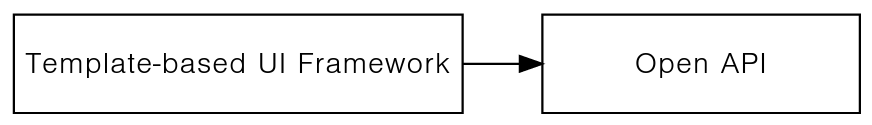
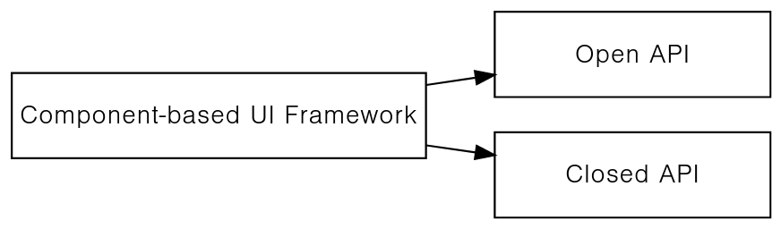

**Template-based UI frameworks** use class names as API mechanism to bind together HTML, CSS and Javascript.

The binding is always open. An HTML element can take any number of CSS styles or JavaScript interaction handlers.

This leads to an open API, where everything is possible, even chaotic user interfaces.

**Component-based UI frameworks** use props as API mechanism to bind together HTML, CSS and Javascript into standalone components.

Props-based binding gives a choice. It's up to the framework to decide if it goes with an open or closed API.

## Open and closed APIs

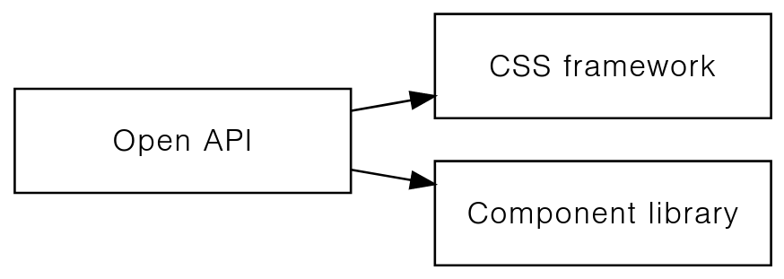

In **open APIs** parts compose up freely.

There are no constraints and there is unlimited room for experimentation and play.

CSS frameworks &mdash; by their nature &mdash; and Component libraries &mdash; by choice &mdash; offer open APIs.

**Closed APIs** restrict the arbitrary composition of the parts with specific rules.

Systems can not build up freely only by abiding the rules.

Classless HTML frameworks &mdash; by their nature &mdash; and Design systems &mdash; by choice &mdash; embrace this closed API principle.

## Consistent and non-consistent UIs

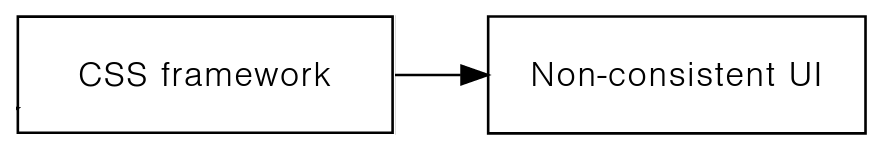
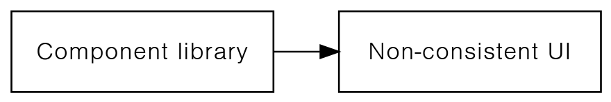
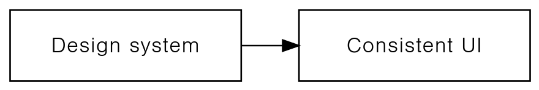

Framework-type and API-type &mdash; combined together &mdash; defines if a paradigm will produce consistent user interfaces, or not.

**CSS frameworks** are Template-based UI frameworks with class-based bindings resulting, involuntarily and by definition, in an open-ended API.

Guaranteeing consistency in such environment is possible, but perhaps only on a small scale, with considerable efforts.

**Component libraries** are Component-based UI frameworks with props-based bindings choosing the open-ended approach for fredom vs. the closed aiming for consistency.

Again, guaranteeing consistency is possible, with efforts.

**Design systems** &mdash; Component-based UI frameworks &mdash; choose the constraints-based API approach to deliver consistency.
