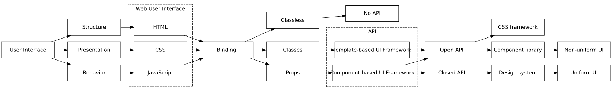

Consistent user interfaces in web context.

<!--more-->

---

## Consistent user interfaces

Consistent &mdash; coherent and uniform &mdash; user interfaces display no visual and logical glitches.

User interfaces, when consistent, _feel_ complete. They have no visible errors, and the experience they provide resembles enjoying an artwork.

Consistent, [by definition](https://www.wordnik.com/words/consistent), is in agreement with itself. It holds true as a group, it's not contradictory. It's marked by an orderly, logical, and aesthetically consistent relation of parts. It's unity and harmony.

Consistent UIs talk about the intent and the mastery of its creators. They persuade. They deliver an important message.

## The current landscape

Until recent years, creating &mdash; designing and developing &mdash; consistent user interfaces were a herculean task.

With [design systems thinking](http://metamn.io/react/on-design-systems-2/) &mdash; by introducing a novel design process &mdash; now consitent _design_ is possible.

The question is still open for the implementation part. Is consistent implementation possible?

The design / development separation exists because current UX/UI design tools and processes, even following the design systems paradigm, produce visual deliverables. Artifacts requiring further translation to a computing platform via code.

This article examines the web platform. How to develop consistent UIs with web technologies?

## The web context

The web platform &mdash; we all know well &mdash; is the browser.

By using technologies like HTML, CSS, and Javascript &mdash; it manages to display interactive information across different devices and operating systems.

Developing consistent UIs in web context, thus, translates into implementing a design system with HTML, CSS, and Javascript &mdash; and running it in the browser.

## The historical context

Web front-end development has a long history. Through decades, it evolved from one paradigm to another.

Let's put design systems into this historical context.

Each quadrant represents an era in web development; the historical timeline reads counter-clockwise; the axes connect web development to general software development practice: APIs and frameworks.

And the story, in short, follows.

In the beginning &mdash; **Classless HTML** &mdash; there wasn't much styling and interactivity on websites. HTML was not linked to CSS and Javascript via class names &mdash; hence the name.

**CSS Frameworks** are the longest reigning paradigm. They are ubiquitous. Perhaps they are responsible for styling 90% or more of all webpages today. CSS frameworks are all household names: Bootstrap, Foundation, Tachyons, Bulma, Tailwind.

**Component libraries** and **design systems** are new. The line between them is blurry &mdash; for the novice &mdash; but important in making a UI consistent or not.

## The journey

It takes a journey from the term `user interface` to `consistent web user interface`.

For those on the run, there is a big picture. It's enjoyable on larger screens via a click.

For the rest, there is a breakdown. A step-by-step guide where at the end a consistent UI approach unfolds.

## User interfaces

User interfaces display information. Information equipped with structure, presentation and behaviour.

Structure and presentation is familiar from graphic and print design. It defines layout and style.

Behaviour is specific to interactive environments like the web. This dynamic context requires the user interface to handle change &mdash; to behave on change.
Per se, it equips information with a dynamic attribute.

## Web user interfaces

Web user interfaces rely on a specific technology &mdash; the browser &mdash; to display information.

Browsers:

- Structure information with **HTML**.
- Define style via **CSS**.
- Handle behaviour using **Javascript**.

## Binding

HTML, CSS and Javascript are standalone technologies. To work together &mdash; they must merge, bind together.

The way of binding &mdash; the binding methods &mdash; are important. Each method defines a paradigm, an era in front-end development.

#### Classless

This paradigm makes no explicit bounds between HTML, CSS and Javascript.

HTML has no classes, thus styles and behaviour attached. Styling comes from a separate CSS file, behaviour comes from a separate JavaScript file, and everything binds together via naming conventions.

Naming conventions are the last thing to scale.

#### Class-based binding

The next paradigm connects the separate parts &mdash; HTML, CSS, Javascript &mdash; via class names, a special HTML attribute.

In spite of being the longest reigning paradigm &mdash; CSS frameworks &mdash; are [fragile](https://www.oreilly.com/library/view/enduring-css/9781787282803/ch02.html) in scaling, composition.

#### Props

The latest advancement specific for component libraries and design systems &mdash; integrate, bind natively all parts of the displayable information &mdash; structure, style, behaviour &mdash; into a single standalone component.

Scaling and composition now relates to one single item &mdash; the component &mdash; vs. three items &mdash; HTML, CSS, and JavaScript &mdash; as it were before.

## API

The acronym stands for Application Programming Interface and comes from general software development theory.

APIs bind together standalone parts of a software system &mdash; in our case HTML, CSS and Javascript &mdash; in a programmable way.

The higher the programmability of the bindings &mdash; based on API &mdash; the better the quality and scalability of the system.

## Template- and Component-based UI frameworks

**Template-based UI frameworks** use class names as an API mechanism to bind together HTML, CSS and Javascript.

The binding is always open. An HTML element can take any number of CSS styles or JavaScript interaction handlers.

This leads to an open API, where everything is possible, even chaotic user interfaces.

**Component-based UI frameworks** use props as an API mechanism to bind together components.

Props-based binding gives a choice. Either go with an open, or a closed API.

## Open and closed APIs

In **Open APIs**, parts compose up freely without constraints. No rules offer unlimited room for experimentation and play.

CSS frameworks &mdash; by their nature &mdash; and Component libraries &mdash; by choice &mdash; offer open APIs.

**Closed APIs** restrict the arbitrary composition of the parts with rules. Rules offer consistency and scalability.

Classless HTML frameworks &mdash; by their nature &mdash; and design systems &mdash; by choice &mdash; embrace the closed API principle.

## Consistent and non-consistent UIs

API-type and framework-type &mdash; combined &mdash; defines if a paradigm will produce consistent user interfaces, or not.

**CSS frameworks** are Template-based UI frameworks with class-based API bindings resulting, involuntarily and by definition, in an open-ended API.

Guaranteeing consistency in such an environment is possible, on a small scale, with considerable efforts.

**Component libraries** are Component-based UI frameworks with props-based API bindings who choose the open-ended approach.

Guaranteeing consistency is possible, again, with restrictions and effort.

**Design systems** &mdash; Component-based UI frameworks &mdash; choose the constraints-based API approach to deliver consistency.

## A new take

Creating consistent user interfaces in web context is possible.

To achieve this feature, one should move away from hacking &mdash; binding with class names &mdash; to programming &mdash; binding with props.

And to move from non-programming languages &mdash; HTML, CSS &mdash; to programming languages &mdash; components built on JSX, CSS-in-JS.

Once everything is programmable, it becomes standard, classic software development.

Where well-known, battle-tested theory and practice &mdash; API, Framework &mdash; apply, to solve consistency and scalability.

## Resources

1. [Consistent — Definitions](https://www.wordnik.com/words/consistent)
2. [On design systems — 2: Tools and processes](http://metamn.io/react/on-design-systems-2/)
3. [The Problems of CSS at Scale](https://www.oreilly.com/library/view/enduring-css/9781787282803/ch02.html)
4. [Two Steps Forward, One Step Back](https://jxnblk.com/blog/two-steps-forward/)
5. [Themeability](https://jxnblk.com/blog/themeability/)
