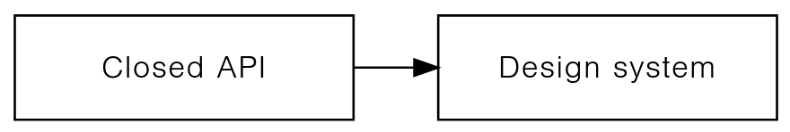

Consistent user interfaces &mdash; in web context.

<!--more-->

---

## Consistent user interfaces

Consistent &mdash; coherent and uniform &mdash; user interfaces eliminate all visual and logical glitches.

User interfaces, when consistent, _feel_ complete. They have no visible errors, and the experience they provide resembles enjoying an artwork.

Consistent, [by definition](https://www.wordnik.com/words/consistent), is in agreement with itself. It holds true as a group, it's not contradictory. It's marked by an orderly, logical, and aesthetically consistent relation of parts. It's unity and harmony.

Consistent UIs talk about the intent and the mastery of its creators. They persuade. They deliver an important message.

## The current landscape

[Until recent years](http://metamn.io/react/on-design-systems-2/), creating consistent user interfaces required discipline and solid mental work.

There were no tools and theory ensuring consistency in UIs. Designers and developers, working in a team, had to verify consistency with mental efforts. An error-prone technique proven incapable to scale.

After decades of innovation, paradigm shifts, today we have systems producing consistent user interfaces &mdash; at least for the web.

It's worth understanding the process, and the results.

## The web context

Let's start by mapping up the buzzwords.
Please note, the historical timeline &mdash; marking the paradigm shifts &mdash; is depicted counter-clockwise.

The buzzwords need to connect with user interfaces, and web user interface technologies like HTML, CSS and Javascript.

It takes a journey from user interfaces to consistent UIs &mdash; almost a dozen of steps, each step further elaborating the process.

---

---

And more. A big picture is available for those in rush. It's enjoyable on larger screens via a click.

## User interfaces

User interfaces display information equipped with structure, presentation and behaviour.

Structure and presentation is familiar from graphic and print design. It defines layout and style.

Behaviour is specific to interactive environments. This dynamic context requires the user interface to handle change &mdash; to behave on change.

Per se, it equips information with a dynamic attribute.

## Web user interfaces

Web user interfaces rely on a specific technology &mdash; the browser &mdash; to display information.

Browsers:

- Structure information with HTML.
- Define style via CSS.
- Handle behaviour using JavaScript.

## Binding

HTML, CSS and JavaScript are standalone technologies. To work together &mdash; they need to bind together.

The way of binding, the binding methods, are important. Each method defines an era in web design and development.

### Classless

This paradigm makes no bounds between HTML, CSS and Javascript.
It leaves binding exclusively to the browser.

HTML has no classes, styles attached. Styling comes from a separate CSS file, where all HTML elements are styled by name.

### Class-based binding

A next iteration, which connects the separate parts &mdash; CSS, Javascript &mdash; via HTML attributes, class names.

### Props

The latest advancement, which integrates &mdash; binds natively &mdash; all parts into a single standalone component. And composes up components via props.

## API

The acronym stands for Application Programming Interface.

APIs bind together the standalone parts of a system &mdash; in our case HTML, CSS and Javascript &mdash; in a programmable way.

The higher the programmability, the better the system.

At the beginning, in the classless era programming the web was difficult. It was no API.

After iterations, and now in the components and props era, the web became fully programmable like any other software environment.

## Template and Component-based UI frameworks

Template-based UI frameworks use class names as API mechanism to bind HTML, CSS and Javascript together.

The binding is open. Parts combine freely without constraints.

An HTML element can take any number of CSS styles or JavaScript interaction handlers.

This leads to an open API. Where everything is possible, even chaotic user interfaces.

Component-based UI frameworks natively bind HTML, CSS and Javascript into standalone components.

They compose up components into larger systems via props &mdash; another, more advanced API mechanism.

Arbitrary composition leads to an open API. Constraints-based composition leads to a closed API.

Component frameworks, unlike Template-based frameworks, are free to choose which way to go.

## Open and closed APIs

In an open API parts compose up freely. There are no constraints and there is unlimited room for experimentation and play.

CSS frameworks and Component libraries embrace this technique.

CSS frameworks have no choice, they are open by nature. Component libraries made this choice explicit.

Closed APIs restrict the composition of the building blocks to specific rules.

Systems can't build up freely but following a purpose and direction.

Design systems embrace the closed API principle.

## CSS frameworks, Component libraries, Design systems

## Non-consistent UI

## Consistent UI
