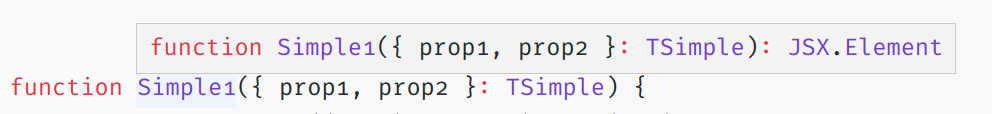
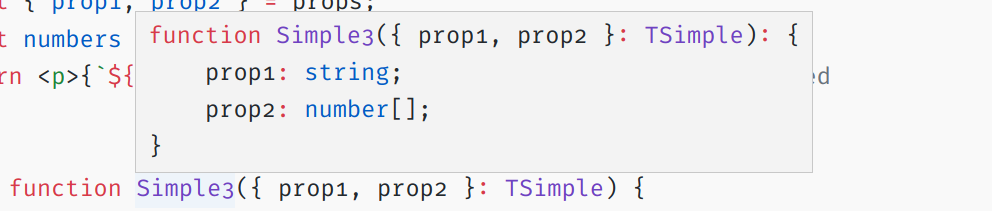
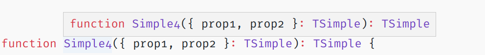
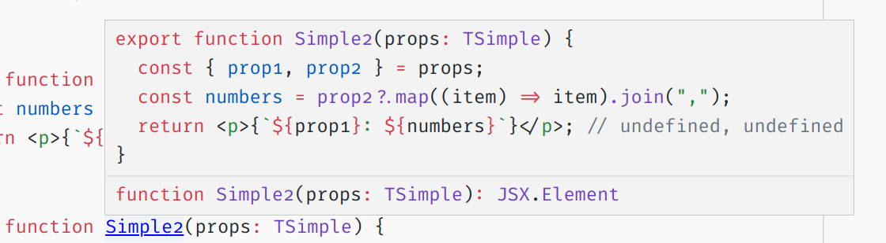
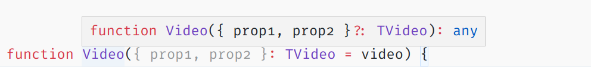
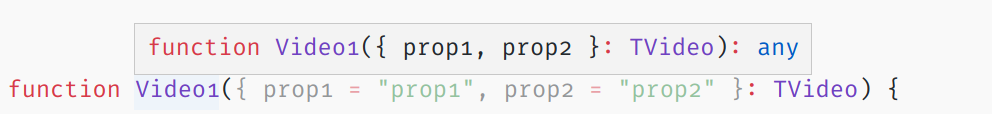
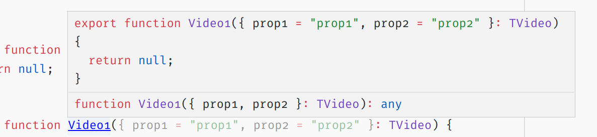
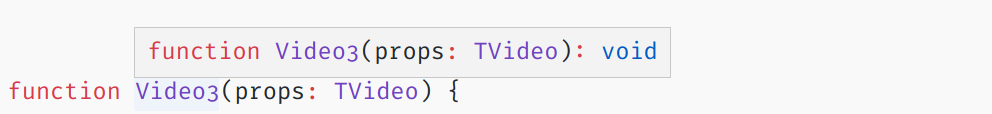
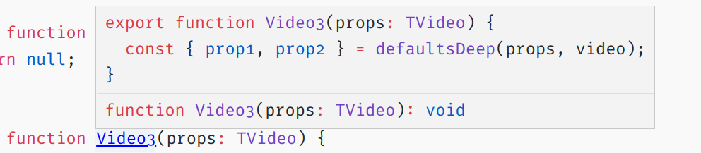

Where to destructure props, and assign default values to them.

<!--more-->

---

This is an interesting topic affecting developer experience: code readability and cognitive load.

There are ways to define component props and associate default values to them.

A common approach is to destructure props in the function signature. Another approach is to destructure them in the function body.

```js
// Destructuring in function signature
function Video({prop1, prop2}: TVideo) {...}

// Destructuring in function body
function Video(props: TVideo) {
  const {prop1, prop2} = props
}
```

Associating default props comes with at least three different approaches.

```js
// Associating default props in function signature
function Video({prop1, prop2}: TVideo = video) {...}

// Associating default props in function signature at destructuring
function Video({prop1: 'prop1', prop2: 'prop2'}: TVideo) {...}

// Associating default props in function body
function Video(props: TVideo) {
  const {prop1, prop2} = merge(props, video)
}
```

Which approach is better? Which approach is complete? What makes an approach better than another?

To answer the questions let's focus first on where to destructure. Then on how to associate default props. Then combine the findings into a verdict.

## Destructuring

tbd.

### Code duplication (Is inevitable)

Assuming type definitions are in place, destructuring leads to code duplication:

```js
interface TVideo {
   prop1: string,
   prop2: string
}

// Duplication in function signature
function Video({prop1, prop2}: TVideo)

// Duplication in function body
function Video(props: TVideo) {
   // The same amount of duplication as above
   const {prop1, prop2} = props
   // When not all props are needed ...
   // ... this approach contains less duplication
   const {prop1} = props
}
```

The advantage goes to the `function body` approach. It can lead to less duplication.

### Usage info on hover (Is incomplete)

Editors try to offer information about functions on hovering or clicking their name.

This comes handy when trying to use a function. It gives hints on usage and return value.

Editors vary in capability to display information on hover.
In my experience VSCode performs better than Atom.
Or Atom just needs a better plugin.
Other editors might perform better than VSCode.

Differences in editor capabilities reduce the importance of this criteria.

For curiosity, and pursuing a better development experience, after playing with various scenarios in VSCode I found:

1. Hover simply returns the function signature, as is, and the function return type.



---

2. When the return type is not defined it is inferred.



---

3. The inferred return type hint is more complete than the defined one.



---

4. `ctrl+hover` return the first 10 lines of the function, as is.



---

Based on the above there is no difference between the two destructuring approaches.

A hover when destructuring is in function signature gives the same information as a `ctrl+hover` when destructuring is in function body.


---


---

In both cases the hint information is incomplete. There is no type information on `prop1`, `prop2`.

## Default props

Default props prevent errors when destructuring undefined props.

Destructuring is inevitable in nested props, and nested props will be present in your code sooner or later.

One can circumvent destructuring by using optional chaining.

```js
// Optional chaining
// - On deeply nested props leads to trainwreck:
// prop1?.prop1a?.prop1aX?.prop1aX...
const text = prop1?.prop1a
const numbers = prop2?.prop2a?.map(item => item).join(',')
```

On long term, when nesting goes deeper, destructuring scales better.

```js
// Destructuring
// - On deeply nested props works fine
const { prop1, prop2 } = props
const { prop1a } = prop1
const { prop2a } = prop2
const numbers = prop2a?.map(item => item).join(',')
```

### Missing props

Optional chaining handles missing props. Destructuring fails with `Unhandled Runtime Error`.

When `prop1` is `null`:

```js
// Returns value `undefined`
const text = prop1?.prop1a
```

```js
const { prop1, prop2 } = props
// Breaks with an error
const { prop1a } = prop1
```

To make destructuring error proof, default values must cover the full depth.

```js
export interface TNested {
  prop1?: {
    prop1a: string,
  };
}

export const nested: TNested = {
  // This doesn't goes full depth.
  // It will give an error on destructuring.
  prop1: null,
}

export const nestedFullDepth: TNested = {
  // This is ok.
  prop1: {
    prop1a: null,
  },
}
```

### Default prop assigment

Once error-proof, nested default props are set up &mdash; they should assign to function props.

In JavaScript object assigment works only with flat objects.
Nested objects need a special function to perform the same task.
Lodash offers such a function: `defaultsDeep`, to recursively assign arbitrarily nested default props to function props.

Associating default props to props in function signature is not straightforward, might be impossible, or might require expert knowledge I don't have at the moment.

```js
// This gives the error:
// Parameter '{ prop1, prop2 }' cannot reference identifier 'prop1' declared after it.ts(2373)
function Video({prop1, prop2}: TVideo = defaultsDeep({prop1, prop2}, nestedFullDepth)) {...}
```

```js
// This gives the error:
// No value exists in scope for the shorthand property 'prop1'. Either declare one or provide an initializer.
function Video({...defaultsDeep({ prop1, prop2 }, nestedFullDepth)}: TNested) {...}
```

Associating default props in function body just works:

```js
function Video(props: TVideo) {
  const { prop1, prop2 } = defaultsDeep({ ...props }, video)
}
```

The advantage goes to the `function body` approach. It works as is.

### Usage info on hover

It's time to revisit how editors display hover hints on functions now with default prop assignments.

#### Associating default props in function signature

```js
function Video({prop1, prop2}: TVideo = video) {...}
```



`ctrl+hover` displays the same amount of information.

#### Associating default props in function signature at destructuring

```js
function Video({prop1: 'prop1', prop2: 'prop2'}: TVideo) {...}
```



`ctrl+hover` displays better information:



#### Associating default props in function body

```js
function Video(props: TVideo) {
  const { prop1, prop2 } = merge(props, video)
}
```



`ctrl+hover` displays better information:



## Summing up

Where to destructure props, and assign default values to them depends on the shape of the props.

When props are flat, destructuring in function signature + assigning default values at destructuring, wins. `ctrl+hover` over the function name displays good enough usage information.

Nested props and the requirement to use a deep merging function requires destructuring in the function body.

The developer experience with `ctrl+hover` over the function name is less pleasant: the default values, helping to infer the prop type, are not shown.
