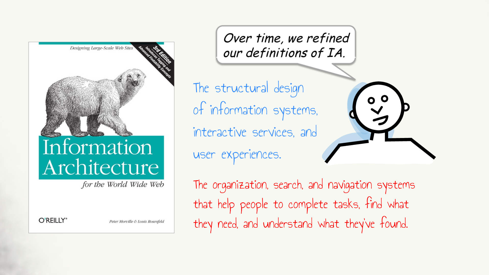
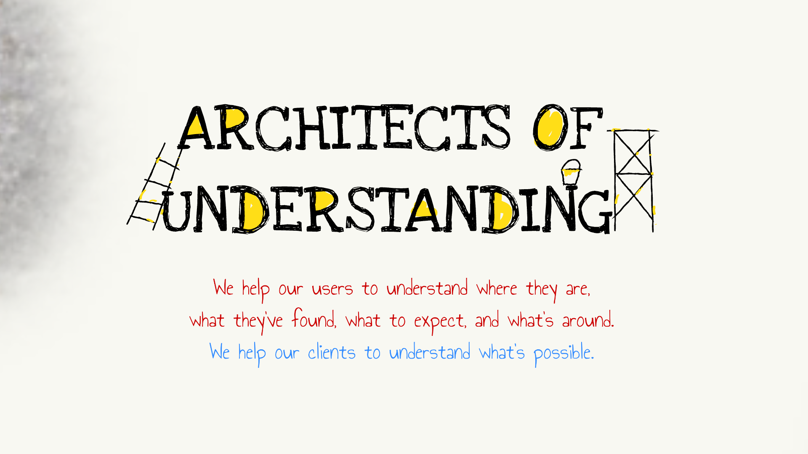

A way to think about Information Architecture in React terms.

<!--more-->


## What is Information Architecture, and what is not?

We all think we know what Information Architecture is &mdash; so why the question?

Wikipedia has [9 definitions](https://en.wikipedia.org/wiki/Information_architecture) for this term. Choosing the ones related to web / app design we have:

1. The art and science of organizing and labeling web sites, intranets, online communities, and software to support findability and usability.
2. The combination of organization, labeling, search and navigation systems within websites and intranets.
3. The practice of organizing the information / content / functionality of a web site so that it presents the best user experience it can, with information and services being easily usable and findable (as applied to web design and development).

These definitions relate to keywords specific to UX design &mdash; usability, experience &mdash; yet there is a [clear differentiation](https://www.uxbooth.com/articles/the-difference-between-ia-and-ux-design/) between IA and UX:

- Information Architecture concerns *structure*.
- User Experience concerns *emotion*.

Let's analyze further Information Architecture by the means of structure.

## Architects of understanding

The term IA was born together with the web and evolved with mobile devices and apps.

Peter Morville, an Information Architecture icon, [captures](https://prezi.com/aafmvya6bk7t/understanding-information-architecture/
) perfectly these moments:



... and concludes with a statement where &mdash; again &mdash; UX is removed:




Here we are in the business of understanding: understanding the problem and understanding how people can best solve the problem &mdash; in a interactive space. 

Information Architecture now has a shape. It's about modeling problem structure and modeling user behavior with the help of user interfaces.

## Structure and behavior

[Dan Klyn](https://www.uxbooth.com/articles/complete-beginners-guide-to-information-architecture/) has a clear take on how to model structure and behavior in user interfaces: with ontology, taxonomy and choreography.

<iframe src="https://player.vimeo.com/video/8866160" width="640" height="480" frameborder="0" allow="autoplay; fullscreen" allowfullscreen></iframe>
<p><a href="https://vimeo.com/8866160">explaining information architecture</a> from <a href="https://vimeo.com/user3007539">Dan Klyn</a> on <a href="https://vimeo.com">Vimeo</a>.</p>

Simplified to this point &mdash; the tasks of an Information Architect are clear:

1. Reduce, limit the complexity of the problem.
2. Organize the information about the problem into data.
3. Define data entities, the properties of entities, and the relations between.
4. Organize entities into hierarchies, maps and views.
5. Design the sequences of movement between the elements above.

## Ontology, taxonomy, choreography and React

Finally we can put React in context with Information Architecture giving developers and UI/UX designers a bigger picture and a shared vocabulary.

Ontology, taxonomy and choreography can act as the boundary between these two different disciplines.

```
|------------|     |------------|     |--------------|
| Ontology   |     | Taxonomy   |     | Choreography |    UI/UX ▲
|------------|     |------------|     |--------------|    -----------
| Data       |     | Sitemap    |     | Events       |    UI/UX + Dev
|------------|     |------------|     |--------------|    -----------
     |                   |                   |            Dev ▼
     |                   |                   |
     ▼                   ▼                   ▼
|------------|     |------------|     |--------------|
| GraphQL    |     | Router     |     | State        |
|------------|     |------------|     |--------------|
     |                   |                   |
     |                   |                   |
     ▼                   ▼                   ▼
|----------------------------------------------------|
|                 React Components                   |
|----------------------------------------------------| 
```


## Resources

- [Information architecture - Wikipedia](https://en.wikipedia.org/wiki/Information_architecture)
- [The Difference Between Information Architecture and UX Design](https://www.uxbooth.com/articles/the-difference-between-ia-and-ux-design/)
- [Understanding Information Architecture](https://prezi.com/aafmvya6bk7t/understanding-information-architecture/)
- [Explaining Information Architecture](https://vimeo.com/8866160)
