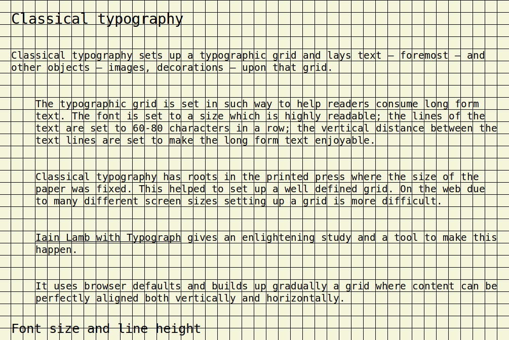

To have an ideal grid where all elements are both vertically and horizontally aligned is possible. And a bit difficult.

<!--more-->

## Classical typography

Classical typography sets up a typographic grid and lays text &mdash; foremost &mdash; and other objects &mdash; images, decorations &mdash; upon that grid.

The typographic grid is set in such way to help readers consume long form text. The font is set to a size which is highly readable; the lines of the text are set to 60-80 characters in a row; the vertical distance between the text lines are set to make the long form text enjoyable.

Classical typography has roots in the printed press where the size of the paper was fixed. This helped to set up a well-defined grid. On the web due to many screen sizes setting up a grid is more difficult.

[Iain Lamb with Typograph](http://lamb.cc/typograph/) gives an enlightening study and a tool to make this happen.

It uses browser defaults and builds up gradually a grid where content can be perfectly aligned both vertically and horizontally.



## Font size and line height

> Here, it pays to work with the grain. Rather than styling everything from scratch, start out by carefully considering what the browser offers by default. Write the CSS from there, as a minimal expression of differences from the default style. This approach gets the job done using the least amount of code, yielding a positive impact on page download speed and the ease with which changes can be made in the future (assuming less code means there is less to understand, maintain, and edit).

The browser sets font size by default to `16px`, and line height [roughly](https://developer.mozilla.org/en-US/docs/Web/CSS/line-height) to `1.2`.

Iain suggests using these values in a specific manner.

Set font size to `100%` (which is `16px`) instead of any other unit. This is a unobtrusive way of setting font size. It doesn't overwrite the font size set in the browser preferences, and it allows users to increase or decrease font size with zooming.

Line height should be set unitless. This way the `font-size * line-height` combo defines a global unit &mdash; cell &mdash; on the grid. Even if later the font size of child elements is changed the grid cell size stays the same across the whole page.

With a `font-size: 100%; line-height: 1.25` the grid cell size will be `16px * 1.25 = 20px`.

## Sizing child elements only with `em`

So far the grid is measured in pixels even if we used `%` and a unitless measure to set it up.

Sizing child elements on a grid with pixels is a bad practice.

[Pixels don't scale](https://stackoverflow.com/questions/609517/why-em-instead-of-px), or more precisely they scale but not proportionally. When zooming a page set in pixels the elements will overflow. When set with relative, elastic units like `em` or `rem` the page will scale nicely and proportionally.

A page scales well on the responsive web when elastic measures are used instead of the absolute `px`. There are many elastic measures &mdash; em, rem, % &mdash; of them [only](https://css-tricks.com/confused-rem-em/) `em` takes consideration it's parent font size.

And Iain's grid is built on font size.

> The mechanics of the em unit offer an excellent way to size child elements in relation to their parents. In fact, if every child element defines its sizing values in em, a chain reaction is set off. Each child becomes proportionally bound to its parent, which in turn is bound to its parent, all the way up to the root element, ancestor of all. In this way, the proportions of the whole document end up being defined in relation to a single, shared value: the font-size of the <body>.

> Documents sized in this way enjoy a golden property, one that most web pages would do well to provide: proportional scaling. Should the user or designer change the base font-size, all the other elements on the page will resize accordingly, preserving their original proportion to the <body>. It will look as if the view has just been zoomed in or out.

Converting the grid size from `px` to `em` is easy. `1em` equals the body font size. In the `16px * 1.25` formula `16px` can be replaced with `1em` to get `1.25em` as the grid size.

## `<body>`

If possible set the grid in the `<body>` element. This way the whole page will have a universal grid layout all children can inherit and build upon.

```javascript
/**
 * Set up the global typographic grid with styled-components
 */
const GlobalStyle = createGlobalStyle`
	body {
		font-size: 100%;
		line-height: 1.25;
		--lem: 1.25em;
	}
`
```

What's important in this setup is `--lem` a.k.a `line in em`. This variable defines the size of both horizontal and vertical grid lines making a grid cell of `1.25em` width and height.

Any element can be positioned on the grid with the `--lem` metrics.

## Responsiveness

The default font size of 16px makes text unreadable on large screens like 1K, or 2K. The text size should grow as the viewport grows.

It's annoying when a page has to be zoomed in to become readable. Instead the site should present an already optimized experience.

With the system proposed by Iain setting up a responsive grid is a breeze. The first child container of `<body>` should increase font sizes as the viewport grows.

```javascript
/**
 * The responsive typography settings
 */
const TypographicGrid = {
  mobile: {
    fontSize: '100%',
  },
  tablet: {
    fontSize: '110%',
  },
  tabletL: {
    fontSize: '140%',
  },
  laptop: {
    fontSize: '160%',
  },
  desktop: {
    fontSize: '200%',
  },
}
```

```javascript
/**
 * The responsive container
 *
 * Note: breakpoints don't follow best practices, just avoid them for now ...
 */
const ResponsiveContainer = styled.div`
  @media (max-width: 767px) {
    font-size: ${props => props.typographicGrid.mobile.fontSize};
  }
  @media (min-width: 768px) and (max-width: 1023px) {
    font-size: ${props => props.typographicGrid.tablet.fontSize};
  }
  @media (min-width: 1024px) and (max-width: 1365px) {
    font-size: ${props => props.typographicGrid.tabletL.fontSize};
  }
  @media (min-width: 1366px) and (max-width: 1559px) {
    font-size: ${props => props.typographicGrid.laptop.fontSize};
  }
  @media (min-width: 1600px) {
    font-size: ${props => props.typographicGrid.desktop.fontSize};
  }
`
```

```javascript
/**
 * The main container
 */
const Container = styled(ResponsiveContainer)`
  padding: var(--lem);

  // From Iain's Typograph
  h1 {
    font-size: 1.5em;
    padding: 1.45833em 0;
  }
  h2 {
    font-size: 1.33333em;
    padding: 1.25em 0;
  }
  h3 {
    font-size: 1.16667em;
    padding: 1.51785em 0;
  }

  // --lem in action
  // Note: this kind of padding is just for demo purposes ...
  p {
    + p {
      margin-top: calc(var(--lem) * 2);
      margin-left: calc(var(--lem) * 2);
    }
  }
`
```

```javascript
/**
* The main class
*/
class TypographyClassic extends React.Component {
	render() {
		return (
			<Container> ... </Container>
		)
	}
```

## What breaks the grid?

To have an ideal grid where all elements are both vertically and horizontally aligned is possible but difficult. One should consider the worth of the effort.

If you have a code block (`<pre><code>...`) which has `overflow-x` set the horizontal scroll bar will break the grid.

If you have a multiline heading ... it will break the grid. Iain's calculator works for single line headings.

This list will grow as one adds new elements to the grid.

## Caveats

Classical typography is useful in certain conditions, namely when everything is sized only with `em`, and, every item is aligned to the top / left on a grid cell.

Combined with modern techniques like Flexbox's `justify-content: center` the grid breaks. Or when elements are sized and positioned with units like `vw` or `vh`.

## When to use?

Sticking to a perfect grid &mdash; which turns to be very fragile &mdash; is recommended only when a long form text is displayed like the content of an article.

For everything else &mdash; layout, navigation, etc &mdash; there are more liberal solutions.

However if one follows [Frank Chimero's approach](https://frankchimero.com/writing/the-webs-grain/) and wants to assemble layouts in David Hockney's style then this technique can be highly powerful.

## Live demo and source code

[MR-UI Storybook](https://tinyurl.com/y85a7dh5) with source code on [Github(https://github.com/metamn/mr-ui/tree/master/src/basics/TypographyClassic)

## Resources

- [Iain Lamb's Typograph](http://lamb.cc/typograph/)
- [EM vs. REM](https://css-tricks.com/confused-rem-em/)
- [Pixels don't scale](https://stackoverflow.com/questions/609517/why-em-instead-of-px)
