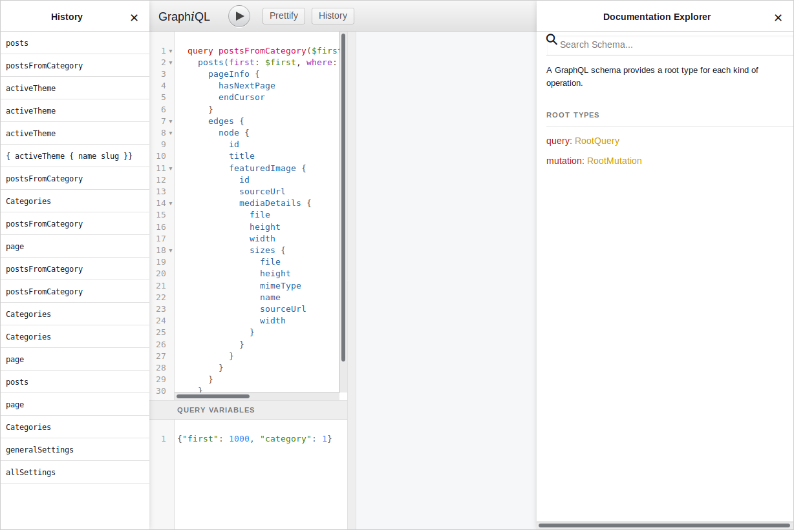
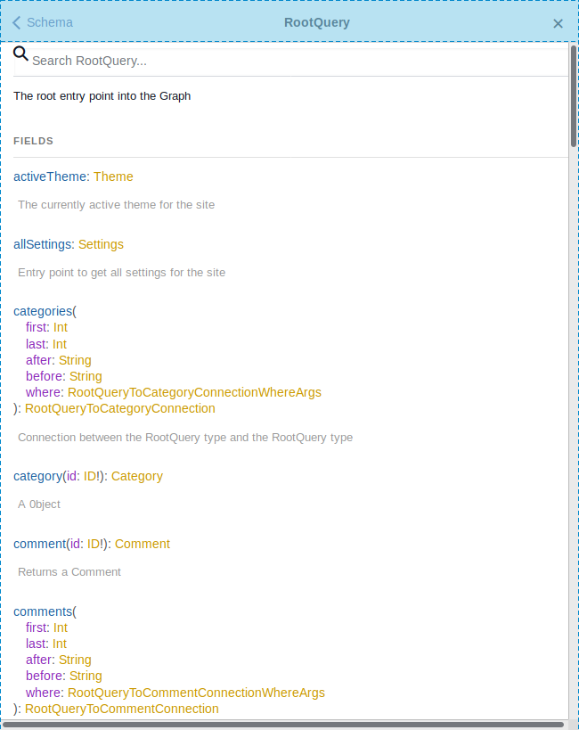

Get a SPA on a headless WordPress!

<!--more-->

## The problem

What if you have to update an old WordPress theme to React? And your only option for deployment is to upload a new theme in the WordPress dashboard?

No static site generation with [Gatsby](https://www.gatsbyjs.org/) and no server side rendering with [Next](https://nextjs.org/).

What left is [create-react-app](https://create-react-app.dev/) which builds a Single Page Application. More exactly [create-react-wptheme](https://github.com/devloco/create-react-wptheme) which adapts `create-react-app` to WordPress.

## create-react-wptheme

`create-react-wptheme` replaces the Webpack dev server coming with `create-react-app` with a WordPress dev server. That makes developing React themes as easy as developing any other React applications.

Deploying the theme is also made easy: you just build it and upload it to WordPress. That's all.

The overall experience is very smooth. So smooth there is nothing to learn about.
Big kudos to [@devloco](https://github.com/devloco), the unknown code artist.

## WPGraphQL

[WPGraphQL](https://www.wpgraphql.com/) and the accompanying [WPGraphiQL](https://github.com/wp-graphql/wp-graphiql) IDE plugins are in the same way fantastic tools.

They replace [WordPress template files and tags](https://developer.wordpress.org/themes/basics/template-hierarchy/) and the most part of the [WordPress API](https://developer.wordpress.org/reference/). You won't need none of these old artifacts.

You won't write PHP code anymore and all theme files will be generated for you except `functions.php` in case you'll want to extend `WPGraphQL`.

### Documentation

Creating themes with GraphQL is documented in the `WPGraphiQL` plugin. Which is also serving as a live testbed for all database operations.

It feels refreshing to read the docs next to the live code editor. It's all in one screen &mdash; without the need to fire up webpages and search for results.

I've found the GraphQL API documentation more useful than the original WordPress documentation. Better navigation, less verbose but straight to the point for a quick lookup and even for a deep dive.

vs.

### Experience

Creating the first theme with GraphQL felt in the same way natural like creating themes the classic way.

In fact it was a more delightful experience.

It was fun to (re)implement the `get_categories()` / `get_category_link()` PHP functions in React and observe this app needs no more from the whole category API.

That makes to feel how light the app is compared to the old approach when no one knew what goes on under the hood and how many functions are called down the stack to perform a simple operation.

### Ecosystem

It's amazing how fast WPGraphQL managed to become the _headless_ part of WordPress.

Integrations with [Advanced Custom Fields](https://www.wpgraphql.com/acf/), [WooCommerce](https://docs.wpgraphql.com/extensions/wpgraphql-woocommerce) and [Gutenberg](https://docs.wpgraphql.com/extensions/wpgraphql-gutenberg) shows the community is taking care of migrating all interesting parts of the old ecosystem to the new one.

Recently the WPGraphQL creator was [backed up by Gatsby](https://wptavern.com/jason-bahl-joins-the-gatsby-team-to-work-on-wpgraphql-full-time) to support further developments. These are signs of a healthy direction for the project.

## Summary

Due to these two fantastic open source contributions WordPress is now ready for simple React theming using the Single Page Application (SPA) paradigm.

SPAs don't [really](https://github.com/metamn/inu-v2-b/issues/32) support multiple URLs and are ideal only for small projects like marketing sites and portfolios.

When more needed &mdash; real URLS, server side rendering, static site generation &mdash; one has to simply replace `create-react-wptheme` with another service like Gatsby or Next.

All existing React and WPGraphQL code stays the same and it can be reused.

## Resources

- [create-react-wptheme](https://github.com/devloco/create-react-wptheme)
- [WPGraphQL](https://www.wpgraphql.com/)
- [Jason Bahl Joins the Gatsby Team to Work on WPGraphQL Full-Time](https://wptavern.com/jason-bahl-joins-the-gatsby-team-to-work-on-wpgraphql-full-time)
- [Sample project](https://github.com/metamn/inu-v2-b)
